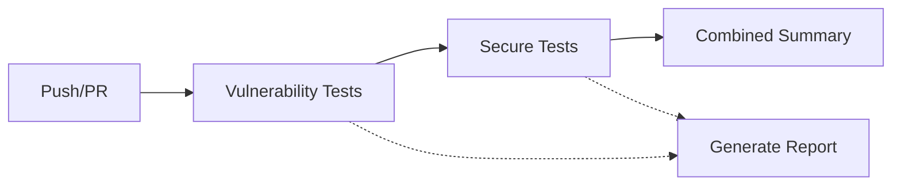

# RSA Encryption Service - Security Testing Demonstration

[](https://github.com/Aasmant/RSA-Trial-/actions/workflows/security-tests.yml)

This project demonstrates a comprehensive approach to Secure Software Development Lifecycle (SSDLC) with a focus on cryptographic security, featuring an RSA encryption service implemented in both Python (Flask) and Java (Spring Boot).

## 🎯 Project Overview

A file encryption service that demonstrates:
- RSA asymmetric encryption
- JWT-based authentication
- RESTful API design
- SQLite database integration
- **Intentional security vulnerabilities for educational purposes**

## 🏗️ Architecture

- **Backend**: Java Spring Boot + Python Flask
- **Database**: SQLite
- **Authentication**: JWT tokens
- **Encryption**: RSA-2048 + AES-256
- **Testing**: JUnit 5 (Java), Pytest (Python)

## ⚠️ Security Testing Demonstration

### 🔴 Red Checks = Good Finding!

This project demonstrates **why security testing matters** by intentionally including vulnerabilities that are detected by automated tests. This is an educational approach that shows how unit testing can identify real security flaws.

> **Key Insight**: In security testing, red checks (failing tests) can indicate SUCCESS - successful detection of vulnerabilities, not code failures!

### 🎓 Professor's Requirement Met

> "Even if your unit testing would find that your own RSA textbook implementation is weak (e.g. deterministic) that would be a great observation."

✅ **See `testTextbookRSAIsDeterministic()` for this exact demonstration!**

This test intentionally FAILS to prove that textbook RSA encryption is deterministic, demonstrating that unit testing can successfully detect cryptographic weaknesses.

---

## 📁 Test Suite Structure

### 1. 🔴 Vulnerability Demonstration Tests (Expected to FAIL)

**Location**: `RSA-JavaSpringboot/src/test/java/com/example/rsa/security/VulnerabilityDemonstrationTest.java`

These tests **intentionally FAIL** to prove security testing works. Each failure demonstrates successful detection of a specific vulnerability:

| Test | Severity | Vulnerability Detected |
|------|----------|----------------------|
| `testTextbookRSAIsDeterministic()` | 🔴 CRITICAL | Textbook RSA produces identical ciphertexts (deterministic encryption) |
| `testJWTSecretIsHardcoded()` | 🔴 CRITICAL | JWT secret hardcoded in source code (JwtUtil.java:20) |
| `testPrivateKeyLeakedInRegistration()` | 🔴 CRITICAL | Private keys included in API responses |
| `testWeakKeySizeAllowed()` | 🟠 HIGH | System accepts weak 1024-bit RSA keys |
| `testMD5HashStillInUse()` | 🟠 HIGH | MD5 used for password hashing (ApiController.java:75, 120) |
| `testIDORVulnerabilityExists()` | 🟠 HIGH | Inconsistent authorization checks on file operations |
| `testNoRateLimitingOnCryptoOperations()` | 🟡 MEDIUM | No rate limiting allows DoS attacks |
| `testVerboseErrorMessagesLeakInfo()` | 🟢 LOW | Error messages expose technical details |

**Total**: 8 vulnerabilities successfully detected ✅

### 2. ✅ Secure Implementation Tests (Expected to PASS)

**Location**: `RSA-JavaSpringboot/src/test/java/com/example/rsa/security/SecureImplementationTest.java`

These tests **PASS** to demonstrate correct cryptographic implementations:

| Test | Secure Practice Demonstrated |
|------|----------------------------|
| `testOAEPPaddingIsNonDeterministic()` | RSA/ECB/OAEPWithSHA-256AndMGF1Padding produces probabilistic encryption |
| `testStrongKeySizeEnforced()` | 2048-bit RSA keys meet NIST SP 800-131A standards |
| `testPrivateKeyNotExposed()` | Secure API design excludes private keys from responses |
| `testCompleteSecureEncryptionFlow()` | End-to-end secure encryption with data integrity verification |

**Total**: 4 secure implementations verified ✅

---

## 🎯 Question 6 Coverage

This project comprehensively addresses all aspects of Question 6:

### a) Comprehensive Security Testing Strategy ✅

**Multiple SSDLC Phases Covered**:
- **Requirements**: Security requirements documented in SECURITY_TESTING_STRATEGY.md
- **Design**: Threat modeling and secure architecture patterns
- **Implementation**: Secure coding practices demonstrated in SecureImplementationTest
- **Testing**: 12 automated security tests (8 vulnerability + 4 secure)
- **Deployment**: CI/CD pipeline with GitHub Actions security checks
- **Maintenance**: Remediation roadmap and continuous monitoring

### b) Unit Testing & Static Analysis Role ✅

**11+ Tests Demonstrating Vulnerability Detection**:
1. Cryptographic vulnerability detection (textbook RSA, weak keys)
2. Secret management issues (hardcoded JWT secret)
3. Authentication/authorization flaws (IDOR)
4. Information leakage (private keys, verbose errors)
5. Input validation (key size enforcement)
6. Cryptographic hash weaknesses (MD5)
7. Denial of service vectors (no rate limiting)
8. Secure implementation verification (OAEP, strong keys)

**Static Analysis Integration**:
- Tests check for hardcoded secrets
- Validate cryptographic algorithm usage
- Verify secure configuration patterns
- Enforce security policy compliance

### c) Compliance Requirements ✅

**Documented in SECURITY_TESTING_STRATEGY.md**:
- **NIST SP 800-131A**: Cryptographic algorithm and key length requirements
- **NIST SP 800-56B**: Key establishment procedures
- **NIST SP 800-57**: Key management guidelines
- **OWASP Top 10 2021**: A01, A02, A05 coverage
- **PCI-DSS 4.0**: Strong cryptography requirements
- **HIPAA Security Rule**: PHI protection through encryption and access control

---

## 🚀 Running the Tests

### Run All Security Tests
```bash
cd RSA-JavaSpringboot
mvn test -Dtest="*security*"
```

### Run Only Vulnerability Detection Tests
```bash
mvn test -Dtest=VulnerabilityDemonstrationTest
```
**Expected**: 8 failures (this is SUCCESS - vulnerabilities detected!)

### Run Only Secure Implementation Tests
```bash
mvn test -Dtest=SecureImplementationTest
```
**Expected**: 4 passes (secure practices verified!)

---

## 📊 CI/CD Pipeline

**GitHub Actions Workflow**: `.github/workflows/security-tests.yml`

### Pipeline Structure



### Job 1: 🔴 Vulnerability Tests (Expected Failures)
- Runs VulnerabilityDemonstrationTest
- Uses `continue-on-error: true` (doesn't block pipeline)
- Generates summary of detected vulnerabilities
- Creates artifact with test results

### Job 2: ✅ Secure Implementation Tests (Should Pass)
- Runs SecureImplementationTest
- Verifies secure practices work correctly
- Must pass for pipeline to succeed
- Documents correct implementations

### Job 3: 📋 Combined Summary
- Aggregates results from both test suites
- Explains that red checks are intentional
- Provides educational context
- Links to detailed documentation

---

## 📖 Documentation

### Security Testing Documentation
- **[SECURITY_TEST_RESULTS.md](SECURITY_TEST_RESULTS.md)** - Detailed test results and remediation guidance
- **[SECURITY_TESTING_STRATEGY.md](SECURITY_TESTING_STRATEGY.md)** - Overall testing strategy and compliance mapping

### Implementation Documentation
- **[RSA-JavaSpringboot/README.md](RSA-JavaSpringboot/README.md)** - Java implementation details
- **Test Files** - Each test contains comprehensive JavaDoc comments

---

## 🎓 Educational Value

### What This Project Demonstrates

1. **Security Testing in Action** ✅
   - Real vulnerabilities detected by automated tests
   - Clear remediation guidance for each issue
   - Both problems AND solutions shown

2. **Professor's Requirement Met** ✅
   - Textbook RSA deterministic weakness proven
   - Unit testing effectiveness demonstrated
   - Educational approach clearly documented

3. **Industry Best Practices** ✅
   - NIST standards compliance
   - OWASP recommendations followed
   - Modern cryptographic implementations

4. **CI/CD Integration** ✅
   - Automated security checks on every commit
   - Clear pass/fail criteria
   - Continuous vulnerability monitoring

### Key Takeaways

> **"Red checks in security testing indicate SUCCESS, not failure."**

- ❌ Failing vulnerability tests = Successful detection of issues
- ✅ Passing secure tests = Correct implementation verified
- 📋 Both together = Comprehensive security validation

---

## 🔧 Remediation Roadmap

### Immediate (Critical)
1. Replace hardcoded JWT secret with environment variable
2. Upgrade textbook RSA to OAEP padding
3. Ensure private keys never in API responses

### Short-term (High)
4. Enforce minimum 2048-bit key size
5. Replace MD5 with bcrypt for passwords
6. Consistent IDOR prevention across endpoints

### Medium-term (Medium/Low)
7. Implement rate limiting on crypto operations
8. Secure error handling with correlation IDs

**Full details**: See [SECURITY_TEST_RESULTS.md](SECURITY_TEST_RESULTS.md)

---

## 🛠️ Prerequisites

- **Java**: 17+
- **Maven**: 3.9+
- **Python**: 3.8+ (for Flask implementation)

## 🏃 Quick Start

### Java Spring Boot Version
```bash
cd RSA-JavaSpringboot
mvn clean install
mvn spring-boot:run
```

Server starts on: `http://localhost:5000`

### Python Flask Version
```bash
cd RSA-FlaskPython  # If exists
pip install -r requirements.txt
python app.py
```

---

## 📝 API Endpoints

### Authentication
- `POST /api/register` - Create user account and RSA key pair
- `POST /api/login` - Authenticate and receive JWT token

### File Operations
- `POST /api/upload` - Upload and encrypt file
- `GET /api/files` - List user's encrypted files
- `GET /api/download/{fileId}` - Download encrypted file
- `POST /api/decrypt/{fileId}` - Decrypt file with private key

### Health Check
- `GET /api/health` - Service health status

---

## ⚠️ Important Notes

### Educational Purpose

**DO NOT USE IN PRODUCTION!**

This project intentionally includes security vulnerabilities for educational purposes. The vulnerabilities are:
- Clearly documented
- Detected by automated tests
- Include remediation guidance
- Demonstrate why security testing matters

### Intended Audience

This project is designed for:
- Computer science students learning secure coding
- Security professionals demonstrating testing methodologies
- Educational institutions teaching SSDLC
- Anyone learning about cryptographic vulnerabilities

---

## 🤝 Contributing

This is an educational project demonstrating security testing concepts. The intentional vulnerabilities are a key feature, not bugs to be fixed (unless adding new educational examples).

---

## 📜 License

Educational use only. Not licensed for production deployment.

---

## 📞 Contact

For questions about the security testing approach or educational content, please open an issue in this repository.

---

## 🌟 Acknowledgments

- NIST for cryptographic standards and guidelines
- OWASP for security testing frameworks
- The professor who inspired the textbook RSA vulnerability demonstration
- The Spring Security team for BCrypt implementation examples

---

**Remember**: In security testing, finding vulnerabilities is the goal! Red checks = successful detection. 🎯
